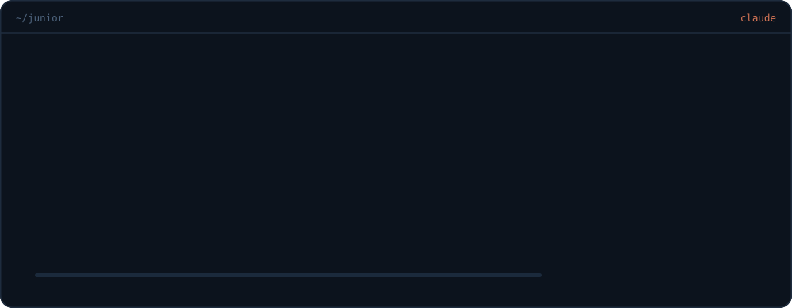

 

### beat me at tic-tac-toe

click a square · it opens an issue · your move lands on its own

<!-- JOGO:INICIO -->

  <table>
    <tr><td></td><td></td><td></td></tr>
    <tr><td></td><td></td><td></td></tr>
    <tr><td></td><td></td><td></td></tr>
  </table>

  <b>Click an empty square. You are ✕.</b>

  visitors 0 · house 0 · draws 0 · last move: @JuniorrBraga

<!-- JOGO:FIM -->

 

  

  

<a href="./README.md">em português</a>

