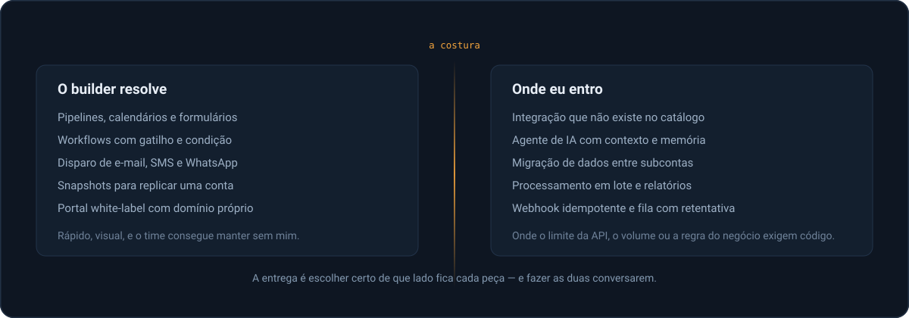

Construo automação comercial e agentes de IA sobre **GoHighLevel**, e escrevo o código onde a plataforma acaba. Trabalho na **AVA Partners**, curso Ciência da Computação e passo o dia no limite entre um builder visual e um editor de texto.

Este perfil é para quem constrói. Se você nunca tocou em GoHighLevel — provavelmente o seu caso — a seção abaixo é o resumo honesto do que esse trabalho é de verdade.

[English version](./README.en.md)

---

## O que é trabalhar com GoHighLevel

GoHighLevel é um CRM white-label multi-tenant. Uma agência tem uma conta; cada cliente vira uma *subconta*. Dentro dela existem pipelines, calendários, formulários, disparo de mensagem e um construtor visual de workflows do tipo gatilho → condição → ação. É vendido como "não precisa de programador", e para boa parte do caminho isso é verdade.

O trabalho interessante começa onde essa promessa termina.

**O builder não tem laço, agregação nem estado.** Ele reage a um evento por vez. No instante em que o problema vira "para cada contato que fez X nos últimos 30 dias, calcule Y e decida Z", não existe caminho dentro da ferramenta. Sai da plataforma, resolve fora, devolve o resultado.

**Webhook não é entrega garantida.** Chega fora de ordem, chega duas vezes, às vezes não chega. Qualquer coisa que dispare cobrança, mensagem ou agendamento precisa ser idempotente — chave de deduplicação, fila com retentativa e backoff. Sem isso, o sintoma aparece do pior jeito possível: a mesma mensagem chegando duas vezes para a mesma pessoa.

**A API v2 é OAuth 2.0 com token por subconta.** Escopo por recurso, limite de requisição por subconta, e o token do cliente é responsabilidade sua guardar e renovar. Uma automação que atende 30 clientes gerencia 30 conjuntos de credenciais.

**Snapshot replica estrutura, não dados.** Ele copia o desenho de uma conta para outra. Migrar contatos, histórico e conversas continua sendo trabalho de extração, transformação e carga — feito com cuidado, porque do outro lado tem uma operação comercial rodando.

**White-label significa que o produto é seu.** Domínio próprio, marca própria, e quando precisa injetar algo que o painel não deixa, um proxy na frente.

A entrega, no fim, é uma decisão de arquitetura repetida muitas vezes: **o que fica no builder e o que vira código.** Errar para o lado do código cria um sistema que só eu mantenho. Errar para o lado do builder cria um workflow de quarenta caixas que ninguém entende em seis meses. O que o time consegue manter sozinho depois que eu saio faz parte do que é entregue.

---

## Como eu trabalho

**Automação que ninguém revisa é automação que mente.** Todo fluxo que roda sozinho tem log, contagem e um jeito de responder "isso rodou hoje?". Job verde que não fez nada é o pior resultado possível — passa despercebido por semanas.

**Prefiro um sistema que o cliente entenda a um que me impressione.** A parte difícil quase nunca é técnica: é decidir o que não construir.

**IA é componente, não enfeite.** Um agente de qualificação precisa de contexto, limite e uma saída que o resto do sistema consiga consumir. Prompt solto sem validação de saída é bug esperando acontecer.

**Escrevo em português.** Código, commit e documentação. É o idioma de quem mantém esses sistemas comigo.

---

## Ferramentas

| | |
|---|---|
| **Plataforma** | GoHighLevel — API v2, webhooks, snapshots, white-label, multi-subconta |
| **Código** | TypeScript · Node · Next.js · React · Python |
| **Dados** | Postgres · Supabase · SQL |
| **IA** | Claude · GPT · Whisper · engenharia de prompt aplicada a funil |
| **Mídia** | FFmpeg — esteiras de edição e legendagem em lote |
| **Operação** | GitHub Actions · Vercel · n8n · Docker |

---

## Painel de produção

Gerado todo dia pela [Action deste repositório](.github/workflows/painel.yml), direto da API do GitHub. Se o token de leitura faltar, o job falha em vez de publicar número velho como se fosse de hoje.

---

## Sobre os repositórios

A maior parte é privada — são sistemas de clientes em operação. O que está público serve para mostrar como eu construo, não o que eu vendo. Arquitetura e demonstração eu mostro em conversa.

**[matchgoal](https://github.com/JuniorrBraga/matchgoal)** — SaaS de análise estatística de futebol com IA. Monorepo pnpm + Turborepo.

---

## Contato

Se você tem um processo comercial preso num builder que não vai mais longe, ou uma integração que a plataforma não oferece, me chama.

**[LinkedIn](https://www.linkedin.com/in/junior-braga/)** · **[bragajuniordev@gmail.com](mailto:bragajuniordev@gmail.com)**
