## Eu construo sistemas que vendem sozinhos

Sou **Luciano Junior Bifano Braga**. Meu trabalho é transformar processo comercial em máquina: o lead entra, o sistema qualifica, nutre, agenda e devolve para o time humano só o que vale a conversa.

Faço isso na **AVA Partners**, onde lidero automação e IA aplicada a vendas — e onde também formo os times que vão operar essas máquinas depois que elas entram no ar. Em paralelo, curso Ciência da Computação, o que me dá a base para descer ao código quando o no-code trava.

Não entrego fluxograma bonito. Entrego coisa rodando em produção.

---

## O que eu resolvo

**Lead que esfria na fila.** Agentes de IA que qualificam por conversa real, pontuam intenção e empurram para o vendedor no momento certo. Não é chatbot de árvore de decisão — é prompt engineering aplicado a funil.

**CRM que ninguém usa.** Implantação de GoHighLevel white-label ponta a ponta: estrutura, integração, migração e treinamento. O sistema só serve se o time adotar, então a adoção faz parte da entrega.

**Trabalho repetitivo que come a margem.** Esteiras que produzem em escala — edição de vídeo, geração de criativos, funis multi-nicho, relatórios. O que era hora de gente vira processo que roda de madrugada.

---

## Máquinas em produção

| Projeto | O que faz | Stack |
|---|---|---|
| **Mestre da Lábia** | Agente de IA de qualificação e conversão de leads por conversa. Validado com lucro real. | TypeScript · LLM |
| **[MatchGoal](https://github.com/JuniorrBraga/matchgoal)** | SaaS de análise estatística de futebol com IA para a Copa 2026. | Turborepo · pnpm · TS |
| **Low Ticket Machine** | Esteira de produtos digitais com funil gamificado multi-nicho. | Next.js · Supabase |
| **Afiliado Machine** | Esteira semi-automática de vídeos de afiliado: da captura ao post aprovado. | Python · FFmpeg · Whisper |
| **AvaZap CRM+** | Integração de WhatsApp e pipeline comercial sobre GoHighLevel. | TypeScript · API GHL |
| **Motor de Edição** | Automação de edição e legendagem de vídeo em lote para a operação. | Python · FFmpeg |

> A maior parte dos repositórios é privada por serem sistemas de clientes em operação. Posso mostrar arquitetura e demo em conversa.

---

## Painel de produção

Gerado automaticamente todo dia pela [Action deste repositório](.github/workflows/painel.yml), direto da API do GitHub. Sem número inflado.

---

## Ferramentas

| Domínio | Stack |
|---|---|
| **IA aplicada** | Claude · GPT · Gemini · Prompt Engineering · Whisper |
| **Automação & CRM** | GoHighLevel · n8n · integrações de API · webhooks |
| **Produto** | TypeScript · Next.js · React · Supabase · Postgres |
| **Backend & dados** | Python · Django · FFmpeg · SQL |
| **Base** | Git · GitHub Actions · Ciência da Computação (Univertix) |

---

## Vamos conversar

Se você tem um processo comercial que depende de gente fazendo a mesma coisa todo dia, provavelmente dá para automatizar boa parte dele.

**[LinkedIn](https://www.linkedin.com/in/junior-braga/)** · **[bragajuniordev@gmail.com](mailto:bragajuniordev@gmail.com)**
