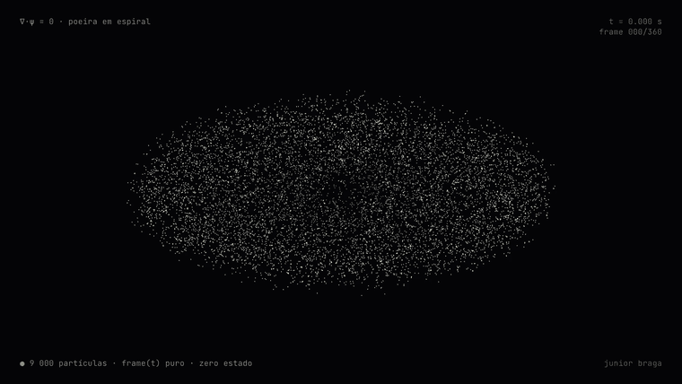
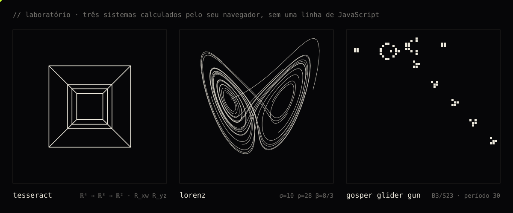

  

  

  

  

<picture>
  <source media="(prefers-color-scheme: dark)" srcset="./assets/cobra-escura.svg">
  <source media="(prefers-color-scheme: light)" srcset="./assets/cobra.svg">
  
</picture>

  

  

<a href="https://www.linkedin.com/in/junior-braga/">linkedin</a>

